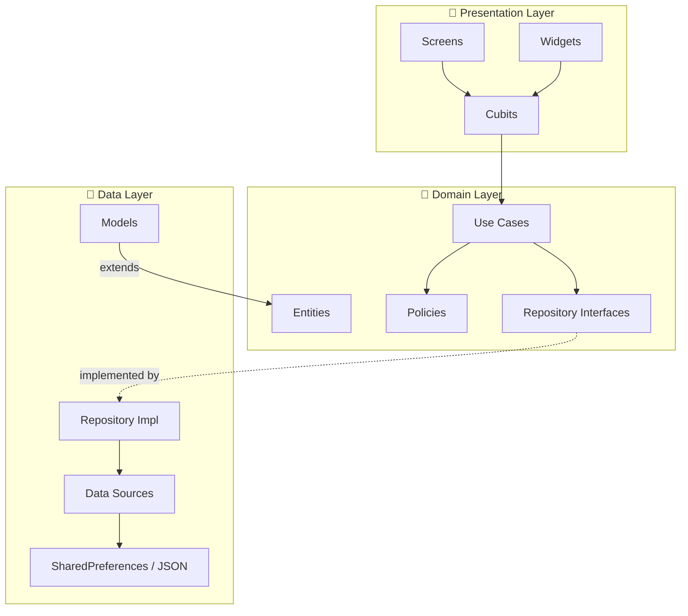
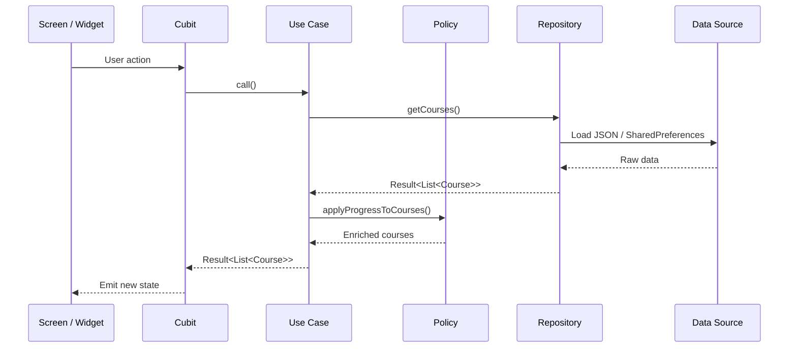
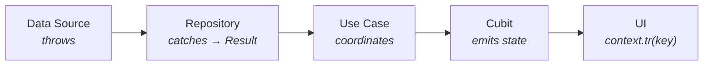

<p align="center">
  
  
  
  
  
</p>

<h1 align="center">🎓 Thaheen — Mini Offline LMS</h1>

<p align="center">
  <strong>A fully offline, Arabic-first mini Learning Management System with video playback, progress tracking, and per-lesson notes — built with Clean Architecture, Cubit, and ❤️</strong>
</p>

<p align="center">
  <em>Flutter screening task for the Thaheen health-sciences learning platform.</em>
</p>

---

## 📑 Table of Contents

- [Quick Start](#-quick-start)
- [Features](#-features)
- [Screenshots](#-screenshots)
- [Tech Stack](#-tech-stack)
- [Architecture](#-architecture)
- [Folder Structure](#-folder-structure)
- [Business Rules](#-business-rules)
- [State Management](#-state-management)
- [Error Handling](#-error-handling)
- [Localization](#-localization)
- [Local Storage](#-local-storage)
- [Testing](#-testing)
- [Design Decisions & Trade-offs](#-design-decisions--trade-offs)
- [Bonus Features](#-bonus-features)

---

## 🚀 Quick Start

**Prerequisites:** Flutter `3.47+` · Dart `3.13+`

```bash
# 1. Clone the repository
git clone https://github.com/<your-username>/mini_offline_lms.git
cd mini_offline_lms

# 2. Install dependencies
flutter pub get

# 3. Run on a connected device / emulator
flutter run

# 4. Run the tests
flutter test
```

> [!NOTE]
> No API keys, no backend setup, no `.env` files. The app is **100% offline** — all data comes from bundled JSON and local MP4 files.

---

## ✨ Features

### Required (All Implemented ✅)

| # | Feature | Description |
|:-:|:--------|:------------|
| 1 | **Courses Screen** | Grid of courses showing thumbnail, title, instructor, lesson count, and live progress percentage. A **"Continue Watching"** card appears at the top when there's an unfinished lesson. |
| 2 | **Course Details** | Expandable sections with lessons, duration, and status badges (`Not Started` · `In Progress` · `Completed`). Locked lessons show a friendly snackbar message. |
| 3 | **Video Player** | Full controls — play/pause, seek bar, timestamps. Supports **4 playback speeds** (1× · 1.25× · 1.5× · 2×). Fullscreen/landscape mode. **Resumes** from last position. Auto-completes at **90%** watched. **Next Lesson** button respects unlock rules. |
| 4 | **Local Persistence** | Lesson positions and completion flags **survive app restarts** via `SharedPreferences`. |
| 5 | **Arabic-first + RTL** | Full RTL layout with correct icon mirroring, padding, and seek bar direction. **Arabic/English toggle** included. |
| 6 | **States & Errors** | Clean loading, empty, and error states everywhere — no red screens. Corrupt/missing video files are handled gracefully. |
| 7 | **Unit Tests** | 16 test files with comprehensive coverage of the progress logic, unlock rules, and data layers. |

### Bonus (Also Implemented 🎁)

| Bonus | Status |
|:------|:------:|
| 🌙 Dark mode with persistence | ✅ |
| 🔍 Course search | ✅ |
| 📝 Per-lesson notes (CRUD) | ✅ |
| ⏩ Remember last playback speed | ✅ |

---

## 📸 Screenshots

<!-- Replace with actual screenshots -->
> Add screenshots or a screen recording here showing the Courses list, Course details, Video player, Dark mode, and RTL layout.

---

## 🛠 Tech Stack

| Category | Choice | Why |
|:---------|:-------|:----|
| **Framework** | Flutter 3.47+ | Stable channel, latest Dart 3.13+ features (dot shorthands, null-aware elements, switch expressions) |
| **State Management** | [flutter_bloc](https://pub.dev/packages/flutter_bloc) (Cubit) | Predictable, testable state with minimal boilerplate. Cubit is simpler than full Bloc when events aren't needed. |
| **Navigation** | [go_router](https://pub.dev/packages/go_router) | Declarative, type-safe URL-based routing with path parameters |
| **DI** | [get_it](https://pub.dev/packages/get_it) | Lightweight service locator — no code generation required |
| **Local Storage** | [SharedPreferences](https://pub.dev/packages/shared_preferences) | Simple key-value pairs are perfectly suited for position integers and boolean completion flags |
| **Localization** | [easy_localization](https://pub.dev/packages/easy_localization) | JSON-based translation files with hot reload support |
| **Video** | [video_player](https://pub.dev/packages/video_player) + [chewie](https://pub.dev/packages/chewie) | The official Flutter video package wrapped with Chewie for richer controls |
| **Testing** | [mocktail](https://pub.dev/packages/mocktail) + [bloc_test](https://pub.dev/packages/bloc_test) | No code generation mocking + specialized Cubit testing helpers |
| **Font** | Cairo (Variable) | Native Arabic + Latin font, bundled locally |

---

## 🏗 Architecture

The project follows **Clean Architecture** with a clear three-layer separation, enhanced by **Use Cases** for intent coordination and **Domain Policies** for pure business logic.



### Layer Responsibilities

| Layer | Responsibility | Key Rule |
|:------|:---------------|:---------|
| **Presentation** | UI rendering, user interaction, state observation | Cubits call Use Cases, never touch repositories directly |
| **Domain** | Business entities, rules, and contracts | **Zero dependencies** on Flutter, data, or UI. Pure Dart. |
| **Data** | JSON parsing, SharedPreferences I/O, repository implementations | Models **extend** Entities (no `.toEntity()` mappers needed) |

### Data Flow



---

## 📁 Folder Structure

```
lib/
├── main.dart                          # App entry point
├── app.dart                           # Root MaterialApp with theme & localization
│
├── core/
│   ├── config/
│   │   ├── di/
│   │   │   └── service_locator.dart   # get_it registration for all dependencies
│   │   ├── router/
│   │   │   ├── app_router.dart        # go_router setup with BlocProviders at route level
│   │   │   └── app_routes.dart        # Centralized route path constants & helpers
│   │   └── theme/
│   │       ├── app_colors.dart        # Seed colors & surface tokens
│   │       ├── app_theme.dart         # Light & dark ThemeData definitions
│   │       └── theme_cubit.dart       # Theme mode persistence & toggling
│   │
│   ├── error/
│   │   └── result.dart                # Sealed Result<T> = Success | Failure
│   │
│   ├── utils/extensions/
│   │   ├── context_extensions.dart    # Shortcuts: colorScheme, textTheme, isRtl, etc.
│   │   └── duration_extensions.dart   # Duration → "mm:ss" formatting
│   │
│   └── widgets/                       # App-prefixed shared widgets
│       ├── app_empty_view.dart
│       ├── app_error_view.dart
│       ├── app_language_toggle.dart
│       ├── app_loader.dart
│       ├── app_snack_bar.dart
│       └── app_theme_toggle.dart
│
├── features/
│   ├── courses/
│   │   ├── data/
│   │   │   ├── data_sources/          # CoursesDataSource (abstract) + CoursesLocalDataSource
│   │   │   ├── models/               # CourseModel, SectionModel, LessonModel (extend entities)
│   │   │   └── repositories/         # CoursesRepositoryImpl → Result wrapping
│   │   ├── domain/
│   │   │   ├── entities/             # Course, Section, Lesson, ContinueWatching
│   │   │   ├── policies/            # CourseUnlockPolicy (90% threshold + sequential unlock)
│   │   │   ├── repositories/        # CoursesRepository (abstract interface)
│   │   │   └── use_cases/           # GetCoursesUseCase, GetCourseDetailsUseCase, SearchCoursesUseCase
│   │   └── presentation/
│   │       ├── cubit/
│   │       │   ├── courses_list/     # CoursesListCubit + state
│   │       │   └── course_details/   # CourseDetailsCubit + state
│   │       ├── screens/             # CoursesScreen, CourseDetailsScreen
│   │       └── widgets/             # CourseCard, ContinueWatchingCard, SectionCard, LessonTile, etc.
│   │
│   ├── player/
│   │   ├── data/
│   │   │   ├── data_sources/        # ProgressDataSource (abstract) + ProgressLocalDataSource
│   │   │   └── repositories/        # ProgressRepositoryImpl
│   │   ├── domain/
│   │   │   ├── entities/            # LessonProgress
│   │   │   ├── repositories/       # ProgressRepository (abstract interface)
│   │   │   └── use_cases/          # Get/SaveLessonProgress, GetNextLesson, Get/SavePlaybackSpeed
│   │   └── presentation/
│   │       ├── cubit/              # PlayerCubit + state
│   │       ├── screens/            # LessonPlayerScreen
│   │       └── widgets/            # VideoPlayerView, PlaybackSpeedSelector, NextLessonButton, etc.
│   │
│   └── notes/
│       ├── data/
│       │   ├── data_sources/        # NotesDataSource (abstract) + NotesLocalDataSource
│       │   ├── models/             # LessonNoteModel
│       │   └── repositories/       # NotesRepositoryImpl
│       ├── domain/
│       │   ├── entities/           # LessonNote
│       │   ├── repositories/      # NotesRepository (abstract interface)
│       │   └── use_cases/         # Add, Get, Update, Delete LessonNote use cases
│       └── presentation/
│           ├── cubit/             # LessonNotesCubit + state
│           └── widgets/           # AddNoteField, NoteItemCard, NoteEditMode, NoteViewMode
│
├── l10n/
│   ├── ar.json                       # 56 Arabic translation keys
│   └── en.json                       # 56 English translation keys
│
test/
├── features/
│   ├── courses/
│   │   ├── data/
│   │   │   ├── data_sources/        # CoursesLocalDataSource tests
│   │   │   ├── models/             # CourseModel, SectionModel, LessonModel tests
│   │   │   └── repositories/       # CoursesRepositoryImpl tests
│   │   └── domain/
│   │       ├── entities/           # Course, Lesson, ContinueWatching tests
│   │       ├── policies/          # CourseUnlockPolicy tests (90% rule, sequential unlock)
│   │       └── use_cases/         # GetCoursesUseCase, GetCourseDetailsUseCase tests
│   └── player/
│       ├── data/
│       │   ├── data_sources/      # ProgressLocalDataSource tests
│       │   └── repositories/      # ProgressRepositoryImpl tests
│       └── domain/use_cases/      # GetLessonProgress, GetNextLesson, SaveLessonProgress tests
```

> **83 source files** · **~5,500 lines of application code** · **16 test files** · **~1,500 lines of test code**

---

## 📐 Business Rules

All business rules live inside [`CourseUnlockPolicy`](lib/features/courses/domain/policies/course_unlock_policy.dart) — a **pure Dart class with zero dependencies** on Flutter, data sources, or UI. This keeps domain logic isolated, deterministic, and trivially testable.

### 90% Completion Rule

A lesson is automatically marked as **completed** when the watch position reaches ≥ 90% of the total duration:

```dart
static bool isLessonCompleted({
  required int positionSec,
  required int durationSec,
  bool isAlreadyCompleted = false,
}) {
  if (isAlreadyCompleted) return true;
  return durationSec > 0 && positionSec >= (durationSec * completionThreshold);
}
```

### Sequential Unlock

Lessons unlock **one by one** — a lesson is playable only if the previous lesson in the same section is completed. The **first lesson in each section is always unlocked**.

```dart
var previousCompleted = true; // First lesson always unlocked
for (final lesson in section.lessons) {
  final isLocked = !previousCompleted;
  previousCompleted = completed;
  // ...
}
```

### Progress Percentage

Course progress is calculated as a simple ratio:

$$\text{Progress} = \frac{\text{Completed Lessons}}{\text{Total Lessons}} \times 100$$

### Continue Watching

The "Continue Watching" card resolves to the **first in-progress lesson** (has a saved position but is not yet completed) across all courses, scanning sequentially.

---

## 🔄 State Management

### Why Cubit over full Bloc?

**Cubit** was chosen over full Bloc because:

- Events are unnecessary when every user action maps 1:1 to a method call
- Less boilerplate — no event classes, no `on<Event>` handlers
- Still fully testable with `bloc_test`'s `blocTest()` helper
- Same predictable state emission pattern

### Cubit Architecture

Each Cubit receives **Use Cases** (never repositories directly), calls them, and pattern-matches on the sealed `Result<T>`:

```dart
Future<void> loadCourses() async {
  emit(const CoursesListLoading());
  final result = await _getCoursesUseCase();
  switch (result) {
    case Success(:final data):
      emit(CoursesListLoaded(courses: data, continueWatching: ...));
    case Failure(:final message):
      emit(CoursesListError(message));   // passes localization key
  }
}
```

### BlocProvider Injection

`BlocProvider`s are created at the **route level** inside [`app_router.dart`](lib/core/config/router/app_router.dart), not in screen widgets. This keeps screens clean and ties Cubit lifecycle to route lifecycle:

```dart
GoRoute(
  path: AppRoutes.courses,
  builder: (context, state) => BlocProvider(
    create: (_) => sl<CoursesListCubit>()..loadCourses(),
    child: const CoursesScreen(),
  ),
),
```

---

## 🛡 Error Handling

A single sealed [`Result<T>`](lib/core/error/result.dart) type flows through the entire architecture:

```
Data Source → throws Exception
Repository  → catches, returns Failure('localizationKey')
Use Case    → pattern-matches, coordinates with policies
Cubit       → pattern-matches, emits state (never catches)
UI          → localizes the key via context.tr(key)
```



> [!IMPORTANT]
> Error messages are **localization keys**, not raw strings. The UI layer is the only place where translation happens — via `context.tr(message)`. This keeps the domain and data layers language-agnostic.

---

## 🌍 Localization

- **Engine:** [`easy_localization`](https://pub.dev/packages/easy_localization) with JSON translation files
- **Default locale:** Arabic (`ar`) — the app launches in Arabic
- **Supported:** Arabic (`ar`) + English (`en`)
- **56 translation keys** with full parity between both languages
- **Runtime toggle:** [`AppLanguageToggle`](lib/core/widgets/app_language_toggle.dart) widget in the app bar

Translation files live in [`lib/l10n/`](lib/l10n/):

| File | Language | Keys |
|:-----|:---------|:-----|
| [`ar.json`](lib/l10n/ar.json) | Arabic (primary) | 56 |
| [`en.json`](lib/l10n/en.json) | English | 56 |

**Usage rule:** Every user-facing string uses `context.tr('key')` — no hardcoded text anywhere.

---

## 💾 Local Storage

### Why SharedPreferences?

| Option | Considered? | Verdict |
|:-------|:-----------:|:--------|
| **SharedPreferences** | ✅ Chosen | Perfect fit — we're storing simple key-value pairs: `position_<lessonId> → int`, `completed_<lessonId> → bool`, `preferred_playback_speed → double`, `app_theme_mode → String` |
| Hive / Isar | Considered | Overkill for flat key-value data with no relationships or complex queries |
| sqflite | Considered | SQL overhead is unnecessary when there's no relational data |

### Storage Keys

All persistence goes through [`ProgressLocalDataSource`](lib/features/player/data/data_sources/progress_data_source.dart):

| Key Pattern | Type | Purpose |
|:------------|:-----|:--------|
| `position_<lessonId>` | `int` | Last watched position in seconds |
| `completed_<lessonId>` | `bool` | Whether the 90% threshold was reached |
| `preferred_playback_speed` | `double` | User's preferred speed (1.0 – 2.0) |
| `app_theme_mode` | `String` | `"light"` or `"dark"` |
| `notes_<lessonId>` | `String` | JSON-encoded list of lesson notes |

> [!TIP]
> SharedPreferences is accessed **only** through abstract data source interfaces, never directly in Cubits or widgets. This maintains testability through dependency inversion.

---

## 🧪 Testing

### Test Coverage Overview

**16 test files** · **~1,500 lines of test code** covering every architectural layer:

| Layer | Tests | What's Tested |
|:------|:-----:|:--------------|
| **Domain Policies** | ✅ | 90% completion rule, sequential unlock, cross-section independence |
| **Domain Entities** | ✅ | Progress percentage, lesson status derivation, continue watching resolution |
| **Use Cases** | ✅ | Data coordination with policies, Result propagation |
| **Repositories** | ✅ | Exception → Failure wrapping, data passthrough |
| **Data Sources** | ✅ | JSON parsing, SharedPreferences key correctness |
| **Models** | ✅ | `fromJson` round-trip fidelity |

### The Three Required Tests

The task specification requires at least 3 unit tests for progress logic. Here's where they live:

<details>
<summary><strong>1. 90% Completion Rule</strong> — <code>course_unlock_policy_test.dart</code></summary>

```dart
test('should mark lesson as completed when watched duration reaches exactly 90%', () {
  // Arrange
  const durationSec = 100;
  const positionSec = 90;

  // Act
  final result = CourseUnlockPolicy.isLessonCompleted(
    positionSec: positionSec,
    durationSec: durationSec,
  );

  // Assert
  expect(result, isTrue);
});
```
</details>

<details>
<summary><strong>2. Sequential Unlock Rule</strong> — <code>course_unlock_policy_test.dart</code></summary>

```dart
test('should unlock second lesson when first lesson is completed', () {
  // Arrange
  bool isCompleted(String id) => id == 'l1';
  int getPosition(String id) => id == 'l1' ? 95 : 0;

  // Act
  final updatedCourse = CourseUnlockPolicy.applyProgressToCourse(
    course: testCourse,
    isCompleted: isCompleted,
    getPosition: getPosition,
  );

  // Assert
  final lessons = updatedCourse.sections.first.lessons;
  expect(lessons[0].isCompleted, isTrue);
  expect(lessons[1].isLocked, isFalse);
  expect(lessons[2].isLocked, isTrue);
});
```
</details>

<details>
<summary><strong>3. Progress % Calculation</strong> — <code>course_test.dart</code></summary>

```dart
test('should calculate progressPercentage as completed / total * 100', () {
  // Arrange — course with 3 lessons, 1 completed
  // Act
  final progress = course.progressPercentage;

  // Assert
  expect(progress, closeTo(33.33, 0.01));
});
```
</details>

### Running Tests

```bash
# Run all tests
flutter test

# Run with coverage report
flutter test --coverage

# Run a specific test file
flutter test test/features/courses/domain/policies/course_unlock_policy_test.dart
```

---

## 🤔 Design Decisions & Trade-offs

### Models Extend Entities

**Decision:** `CourseModel extends Course` instead of separate mapper classes.

**Why:** A Model **is** an Entity with JSON serialization added. This eliminates boilerplate `.toEntity()` mappers while keeping the domain layer pure — entities have zero knowledge of JSON.

### Domain Policies (not in Cubits or Repositories)

**Decision:** Business rules like the 90% threshold and sequential unlock live in [`CourseUnlockPolicy`](lib/features/courses/domain/policies/course_unlock_policy.dart) — a static, pure Dart class.

**Why:** This keeps rules:
- **Testable** without mocking anything (pure functions in, deterministic results out)
- **Reusable** across multiple Use Cases without duplication
- **Discoverable** — all business rules are in one place, not scattered across Cubits

### Use Cases as Coordinators

**Decision:** Use Cases coordinate between repositories and policies — they don't contain business logic themselves.

**Why:** A Use Case like [`GetCoursesUseCase`](lib/features/courses/domain/use_cases/get_courses_use_case.dart) fetches data from `CoursesRepository`, then feeds it to `CourseUnlockPolicy` with progress from `ProgressRepository`. This single-responsibility pattern means repositories stay data-only and policies stay logic-only.

### No `dynamic`, No `!`

The codebase uses `Object?`, typed generics, and sealed classes instead of `dynamic`. The null-assertion operator (`!`) is avoided unless non-null is structurally guaranteed.

### No Presentation File > 200 Lines

Every screen and widget file stays under 200 lines. Complex views are decomposed into smaller, class-based widgets in separate files — never helper methods returning `Widget`.

---

## 🎁 Bonus Features

### 🌙 Dark Mode

- Persisted via `SharedPreferences` through [`ThemeCubit`](lib/core/config/theme/theme_cubit.dart)
- Medical Teal (`#007A78`) seed color with Material 3 `ColorScheme.fromSeed`
- Toggle via [`AppThemeToggle`](lib/core/widgets/app_theme_toggle.dart) in the app bar

### 🔍 Course Search

- Real-time filtering via [`SearchCoursesUseCase`](lib/features/courses/domain/use_cases/search_courses_use_case.dart)
- Searches course titles and instructor names
- Dedicated [`CoursesSearchBar`](lib/features/courses/presentation/widgets/courses_search_bar.dart) widget
- Empty state when no results match

### 📝 Per-Lesson Notes

- Full CRUD: **Add**, **Edit**, **Delete** notes on any lesson
- Persisted locally in SharedPreferences as JSON
- Dedicated feature module with its own entity, repository, 4 use cases, and cubit
- Inline editing with character count and edit timestamps

### ⏩ Persistent Playback Speed

- Speed preference (1× · 1.25× · 1.5× · 2×) saved via [`SavePlaybackSpeedUseCase`](lib/features/player/domain/use_cases/save_playback_speed_use_case.dart)
- Restored automatically when opening any lesson

---


